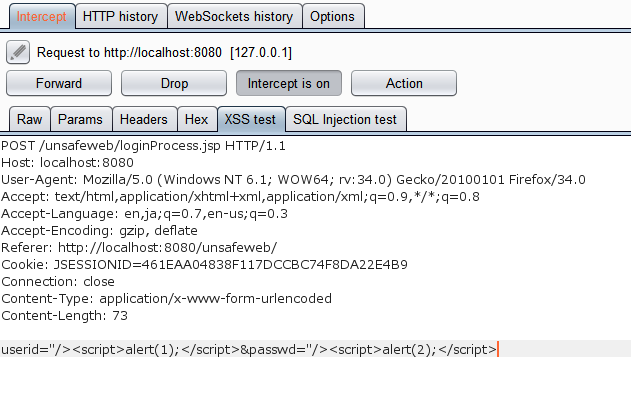
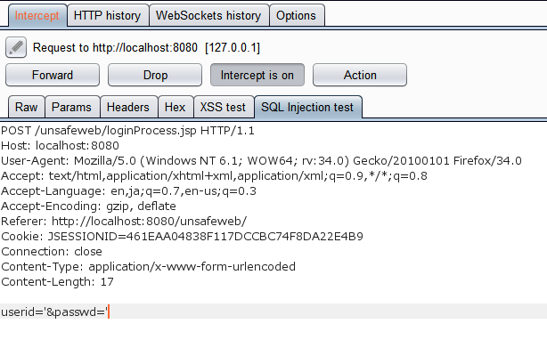

<h2>Table of Contents</h2>

<ul>
<li><a href="#sec-1">1. Summary</a>
<ul>
<li><a href="#sec-1-1">1.1. XSS test</a></li>
<li><a href="#sec-1-2">1.2. SQL Injection test</a></li>
</ul>
</li>
</ul>

# Summary

Simple Test for XSS and SQL Injection.

## XSS test

## SQL Injection test

